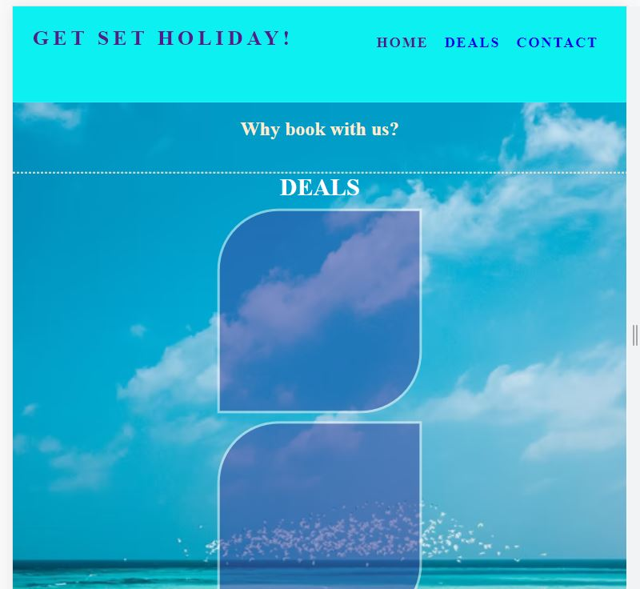

<h1 align="center">Get Set Holiday</h1>

[View the live project here](https://begumdev.github.io/GetSetHoliday/index.html)

Targeted to UK holiday makers, this website is designed to advertise package holiday deals to people looking to book holidays worldwide.

***
# User Exeprience (UX)

- ### User stories
    - #### First time visitor goals
        1. As a first time visitor I want to be able to understand that the website is advertising holiday deals.
        2. I want to be able to navigate around the website easily with all information organised in order of relevance.
        3. I want to be able to see testimonials from other holiday makers with their experience with this agency and any public social media presence.

    - #### Returning visitor goals
        1. I want to be able to see if there any any new deals or sales added.
        2. I want to be able to give feedback after my own experinces or to be able to make contact prior to any bookings.
        
    - #### Frequent user goals
        1. 
        2. 

    