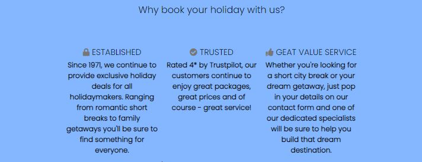

<h1 align="center">Get Set Holiday</h1>

[View the live project here](https://begumdev.github.io/GetSetHoliday/index.html)

Targeted to UK holiday makers, this website is designed to advertise package holiday deals to people looking to book holidays worldwide.

***
## User Experience (UX)
***
- ### User stories
    - #### Site owner goals:
        1. To be able to project an information-centric website detailing holiday deals and packages in an engaging and asthetically pleasing way so that it invites the customer to explore packages.
        2. To be able to display the information in a chronological order in accordance to its priority so it helps the customer subconsciously consider a booking.
        3. To make the customer intuitively find information that leads them to complete a booking.

    - #### First time visitor goals:
        1. On initial entry to the website, I want to immediately understand what this website is about and some initial obvious information reflecting this.
        2. I want to be able to find information in a fluid manner and centralised in one area. If I want to know more, I should be able to navigate there easily.
        3. I want to be able to make contact and find this information without effort.
        4. I want to see what other experiences have been and any reviews surrounding this.

    - #### Frequent user goals
        1. I want to see if any new deals are featured on the main page.
        2. I want to be able to contact the office for any updates to travel information.
        3. I want to be able to make further bookings.

- ### Design
    * #### Color Scheme
        -   The 3 main colours used are hex colours light grey #d2dbde and 2 shades of blue; #8debff and #84b7ff.
    * #### Typography
        - The fonts used are taken from google fonts named 'Poppins' with a fall-back of sans-serif.
    * #### Imagery
        - The hero image upon landing on the main page is intended to associate with holidays purposely to captivate the users attention. Sunglasses on a beach with the sea in the back can be universally understood to associate with holidays.
- ### Wireframes
    - #### Main page wireframe:
    
    

    - #### Deals page wireframe:

    

    - #### Contact page wireframe:

    
***
## Features
***
* ### Main Page
    1. Navbar - this consists of 2 elements. 
        * A clickable logo - Once clicked, it will direct you to back to the home page. On larger screens purposely set in the top left corner of the webpage as universally expected to be placed. On mobile screens the logo will take up the full width of a column at the head of the page, again to be easily accessible should a user want to return to a home page. The navbar is fixed to the top of the screen on all screen sizes again for ease of access.
        * An interactive menu - a border will appear when hovering over each section of the menu and will disappear when moved off it. This is designed to help guide the user to their intended page. On larger screens the menu will set in the top right hand of the page and on mobile devices will again take up a full width of a row to mimic a desktop menu experience.
        
    2. About us section. 
        * Hero image with a slogan - purposely placed is a simplified image of sunglasses on a beach to denote holidays. The ommitance of any other images is to captivate the users attention inviting them to read the slogan.The slogan itself explains that this is a holiday booking website.
        * Explanatory text - text to supplement the hero image to outline the nature of the website.
        
    3. Insight into deals using deal cards. 
        * A placement of 3 deals is there to help users get a taste of what  deals are on offer. It is intended to draw the users attention and to incite further queries. The price tags are purposely bright again for attention to be drawn.
        
    4. Why book with us.
        * This section outlines reasons to book with us headed by 3 one word titles. These titles are to summarise the main merits of this website. They then go on to elaborate why a customer should feel assured. It also contains a link to the contact page as an initial invite to make contact.
        
    5. Testimonials. 
        * Fictational past experiences have been included to give the user a sense of assurance that we are a reputable service.
        
    6. Footer. 
        * Information including an address, email, phone and social media links have been placed to allow the user easy access in order to make contact. The social media links direct users to an external social media platform.
        
* ### Deals Page
    1. Navbar.
        * In keeping with consistency the navbar is the same throughout the deals page as the main page.
    2. Display of deals. 
        * In keeping with the theme the deals displayed from the main page carry through on the deals page for consistency. On mobile screens the deals card stack in single form focusing attention on each deal. On larger screens the deals card fluidly open out to display next to each other. 
        
    3. Gallery of images. 
        * A display of various scenery of fictational customer photos stack on top of each other on mobile screens again to make user feel included, whilst on larger screens these image enlarge and display like a collage. 
        
    4. Footer.
        * The flow of contact informtion ripple through again to allow ease of access should a customer want to contact us, finding this information with little effort.
* ### Contact Page
    1. Navbar.
        * In keeping with consistency the navbar is the same throughout the deals page as the main page.
    2. Contact information. 
        * Displayed on mobiles screens, the various means of contact are listed in sections one below the other to avoid information condensed into a small screen. Whilst on larger screens the means of contact are displayed next to each other to give the user a sense of options.
        
    3. Contact form. 
        * This page features a contact form to allow the user to send in a message by inputting their personal details. Each input box contains helpful text to guide as what information is needed. In the event the user ommits a field the form will prevent submission and direct to the field needing attention. The email input box also directs the user to insert the correct '@' sign in the event it is ommitted or forgotten. The 'submit' button also changes colour to advise the user it is being hovered over.
        
* ### Thank You Page
    1. Thank you message.
        * In keeping with consistency, once a user submits the contact form, they will be met with an acknowledgement page thanking them for their submission.This page includes the main websites navbar and footer to encourage familiarity. It also includes a direct instruction link to head back to the site.
        
* ### 404 Page.
    1. Error Page.
        * If a user tpyes a broken link, they will receive a 404 error page which is designed to be the same theme as all pages in the website but it will also contain a link back to the website to avoid disorientating a user.
        
***
## Technologies Used
***
### Languages Used
* HTML5
* CSS3
### Frameworks, Libraries & Programs Used
1. Bootstrap v5.1.3:
    * Bootstrap was used to assist with responsiveness on different media screens and centering of content.
2. Google Fonts:
    * 'Poppins' font was imported from Google fonts directly into the stylesheet and used throughout the website for consistency.
3. Font Awesome:
    * Icons used throughout the website were taken from Font Awesome to add detailing and sophistication to the website.
4. Git:
    * Git was used for version control by utilizing the Gitpod terminal to commit to Git and Push to GitHub.
5. Github:
    * GitHub is used to store the projects code after being pushed from Git.
6. Balsamiq:
    * This was used to create wireframes for laptop, tablet and mobile screens.
***
## Testing
***
### Further Testing
### Known Bugs
***
## Deployment
***
### GitHub Pages

The project was deployed to GitHub Pages using the following steps;

1. Log in to GitHub and locate the [GitHub Repository](https://github.com/).
2. At the top of the Repository, click on the 'settings' button.
3. Scroll down the Settings page until you find the "GitHub Pages" Section.
4. Under 'Source', click the dropdown called 'None' and select the branch as 'main.'
5. The page will automatically refresh.
6. Scroll back through the page to locate the now published site [link](https://begumdev.github.io/GetSetHoliday/) in the 'GitHub Pages' section.

### Forking the GitHub Repository

By forking the GitHub Repository we make a copy of the original repository on our GitHub account to view and/or make changes without affecting the original repository by using the following steps...

1. Log in to GitHub and locate the [GitHub Repository](https://github.com/)
2. At the top of the Repository (not top of page) just above the "Settings" Button on the menu, locate the "Fork" Button.
3. You should now have a copy of the original repository in your GitHub account.

### Making a Local Clone

1. Log in to GitHub and locate the [GitHub Repository](https://github.com/)
2. Under the repository name, click 'code' located left of the green 'Gitpod' button.
3. To clone the repository using HTTPS, under "Clone with HTTPS", click on the copy icon right of the link.
4. Open Git Bash.
5. Change the current working directory to the location where you want the cloned directory to be made.
6. Type `git clone`, and then paste the URL you copied in Step 3.
7. Press Enter. Your local clone will be created.
***
## Credits
***
### Code
* The hero image on the main page was inspired by the 'Love Running Project' from Code Institute.
### Content
* All content was written by myself.
### Media
1. Deals Page Collage Images (in order of left to right if viewed on laptop);
    * Family in the water - Natalya Zaritskaya [www.unsplash.com](https://unsplash.com/)
    * Mountains - Rohit Tandon [www.unsplash.com](https://unsplash.com/)
    * Sandy Walkway - Chris Galbraith [www.unsplash.com](https://unsplash.com/)
    * Sunset over water - Nathan Dumlao [www.unsplash.com](https://unsplash.com/)
    * Mother and baby near a mountain - Rachel Cook [www.unsplash.com](https://unsplash.com/)
    * Holiday resort - Kelsey Curtis [www.unsplash.com](https://unsplash.com/)
    * Friends under an umbrella - Rayyu Maldives [www.unsplash.com](https://unsplash.com/)
    * Surfers on a beach - Sebastian Staines [www.unsplash.com](https://unsplash.com/)
### Acknowledgements
* My peers in the Slack community have been great help in asnwering anything needed.
* My mentor Rohit Sharma has been very supportive with great tips.