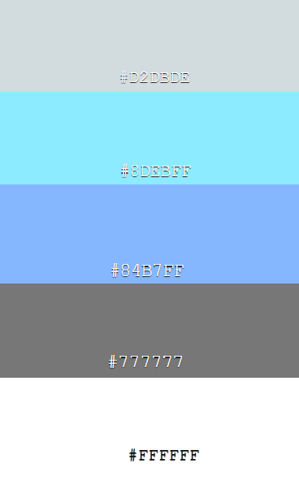
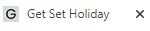
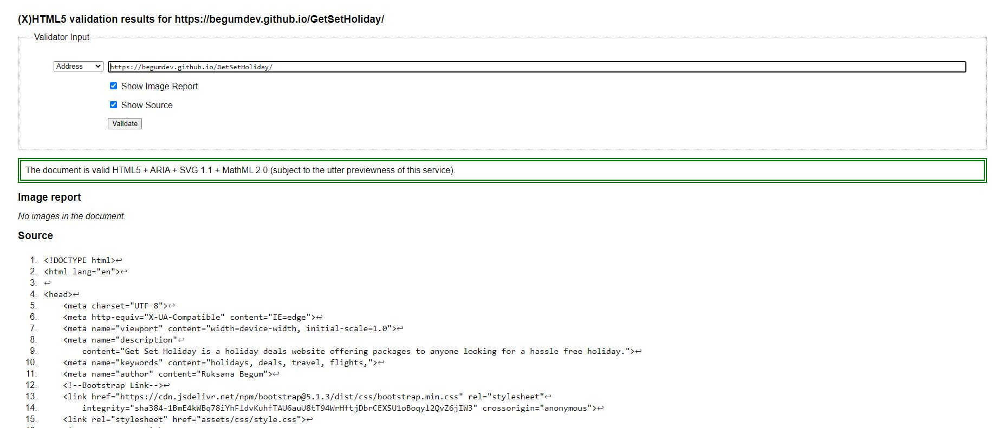

<h1 align="center">Get Set Holiday</h1>

[View the live project here](https://begumdev.github.io/GetSetHoliday/index.html)

Targeted to UK holiday makers, this fictational website is designed to advertise package holiday deals to people looking to book holidays worldwide.

## User Experience (UX)
***
- ### User stories
    - #### Visitor goals:
        1. When I am on the website, I want to always be able to navigate across all pages easily.
        2. I want to be able to see a contact form for the organisation for booking enquiries.
        3. I want to be able to see previous customer reviews and any social media presence.

- ### Design
    * #### Color Scheme
        -  The main colours used are hex colours 2 shades of grey; #d2dbde and #777777, 2 shades of blue; #8debff, #84b7ff and #ffffff white .

        
    * #### Typography
        - The fonts used are taken from google fonts named 'Poppins' with a fall-back of sans-serif.
    * #### Imagery
        1. ##### Main Page
            - The hero image upon landing on the main page is intended to associate with holidays purposely to captivate the users attention. Sunglasses on a beach with the sea in the back can be universally understood to associate with holidays.
            - In each of the deals boxes, roughly 50% of the deals information is an image of the holiday in question, this is to provide visual enhancement in the deal advertised.
        2. ##### Deals Page
            - A display of customers photos in a gallery from is intended to create assurance that this is a reputable organisation.
        3. ##### Contact Page
            - The background in the contact form is designed to subconsciously make the feel user feel as they are there. This is to further incline them to get in touch.

- ### Wireframes
    

Main page wireframe:

    
    
    

    

Deals page wireframe:

    
    

    

Contact page wireframe:

    
    

## Features
***
* ### Favicon
    - A favicon image has been added to the left of the tab when a website is opened. This is in order for the user to be able find the website easily if they have many tabs open.

        

* ### Main Page
    1. Navbar - this consists of 2 elements. 
        * A clickable logo - Once clicked, it will direct you to back to the home page. On larger screens purposely set in the top left corner of the webpage as universally expected to be placed. On mobile screens the logo will take up the full width of a column at the head of the page, again to be easily accessible should a user want to return to a home page. The navbar is fixed to the top of the screen on all screen sizes again for ease of access.
        * An interactive menu - a border will appear when hovering over each section of the menu and will disappear when moved off it. This is designed to help guide the user to their intended page. On larger screens the menu will set in the top right hand of the page and on mobile devices will again take up a full width of a row to mimic a desktop menu experience.

        

    2. About us section. 
        * Hero image with a slogan - purposely placed is a simplified image of sunglasses on a beach to denote holidays. The ommitance of any other images is deliberate to captivate the users attention inviting them to read the slogan. The slogan itself explains that this is a holiday booking website.
        * Explanatory text - text to supplement the hero image to outline the nature of the website.

        

    3. Insight into deals using deal cards. 
        * A placement of 3 deals is there to help users get a taste of what deals are on offer. It is intended to draw the users attention and to incite further queries. The price tags are purposely bright again for attention to be drawn.

        

    4. Why book with us.
        * This section outlines reasons to book with us headed by 3 one word titles. These titles are to summarise the main merits of this website. They then go on to elaborate why a customer should feel assured. It also contains a link to the contact page as an initial invite to make contact.

        

    5. Testimonials. 
        * Fictational past experiences have been included to give the user a sense of assurance that we are a reputable service.

        

    6. Footer. 
        * Information including an address, email, phone and social media links have been placed to allow the user easy access in order to make contact. The social media links direct users to an external social media platform.

        

* ### Deals Page
    1. Navbar.
        * In keeping with consistency the navbar is the same throughout the deals page as the main page.

    2. Display of deals. 
        * In keeping with the theme the deals displayed from the main page carry through on the deals page for consistency. On mobile screens the deals card stack in single form focusing attention on each deal. On larger screens the deals card fluidly open out to display next to each other. 

        

    3. Gallery of images. 
        * A display of various scenery of fictational customer photos stack on top of each other on mobile screens again to make user feel included, whilst on larger screens these image enlarge and display like a collage. 

        

    4. Footer.
        * The flow of contact informtion ripple through again to allow ease of access should a customer want to contact us, finding this information with little effort.

* ### Contact Page
    1. Navbar.
        * In keeping with consistency the navbar is the same throughout the deals page as the main page.
    2. Contact information. 
        * Displayed on mobiles screens, the various means of contact are listed in sections one below the other to avoid information condensed into a small screen. Whilst on larger screens the means of contact are displayed next to each other to give the user a sense of options.

        

    3. Contact form. 
        * This page features a contact form to allow the user to send in a message by inputting their personal details. Each input box contains helpful text to guide as what information is needed. In the event the user ommits a field the form will prevent submission and direct to the field needing attention. The email input box also directs the user to insert the correct '@' sign in the event it is ommitted or forgotten. The 'submit' button also changes colour to advise the user it is being hovered over.

        

* ### Thank You Page
    1. Thank you message.
        * In keeping with consistency, once a user submits the contact form, they will be met with an acknowledgement page thanking them for their submission. This page includes the main websites navigation menu and footer to encourage familiarity. It also includes a direct instruction link to head back to the site. At present it does not contain a database to receive the users details from the form but will be added once the developers knowledge base exapnds therefore a fictational receipt is placed in the forms 'action' instead.

        

* ### Future Features
    - Whilst currently not in the developers expertise, as knowledge will expand, the following features are to be included for the website;
        1. A carousel of holiday destinations in the hero image for sophistication.
        2. An integration in the footer and contact page whereby if a user clicks on the email and phone icon - it will enable them to directly phone out from their phone or send an email from the email app on mobile devices.
        3. A database to add to the current contact form action whereby it can store information using 'post' or 'get'  methods.
        
## Technologies Used
***
### Languages Used
* HTML5
* CSS3

### Frameworks, Libraries & Programs Used
1. Bootstrap v5.1.3:
    * Bootstrap was used to assist with responsiveness on different media screens and centering of content.
2. Google Fonts:
    * 'Poppins' font was imported from Google fonts directly into the stylesheet and used throughout the website for consistency.
3. Font Awesome:
    * Icons used throughout the website were taken from Font Awesome to add detailing and sophistication to the website.
4. Git:
    * Git was used for version control by utilizing the Gitpod terminal to commit to Git and Push to GitHub.
5. Github:
    * GitHub is used to store the projects code after being pushed from Git.
6. Balsamiq:
    * This was used to create wireframes for laptop, tablet and mobile screens.
7. Favicon:
    * This was used to create the favicon in the tab of the webpage.

## Testing
***
* ### Testing user stories from user experience (UX).
    * #### Aim 1; "When I am on the website, I want to always be able to navigate across all pages easily."
        

Passed

        A user will be able to click on each individual page using the navbar. This navigation bar always stays fixed to the top of the device screen for ease of access despite scrolling down the page. For example, if the user whilst halfway down the main page decides they want to now see deals, then they can quite simply click onto the deals page using the navbar. Likewise this applies even whilst being on different pages, the user can choose to hover between pages. This is consistent and responsive on various media devices.

        
        

    * #### Aim 2; "I want to be able to see a contact form for the organisation for booking enquiries."
        

Passed

        A user can click on the contact page in the header and will see a contact form. Placeholder text guides a user as to what information is needed in each field. Once a user inputs all information they can click submit. The form will only work if all fields have data and in the event it doesn't, it will flag a 'required' message in the field data is ommitted. Once all fields have data, the user will recieve a 'thank you' message to confirm the form has been submitted and will guide back to the homepage. This test result is consistent across various media devices also.

        
        
        

    
    * #### Aim 3; "I want to be able to see previous customer reviews and any social media presence."
        

Passed

        Users whilst being on the main page can scroll to the bottom and find (fictational) previous customer reviews with a heading of 'Here's what our customers say.' They are also able to see links in the footer which when clicked will guide them externally to our (fictational) social media platforms whilst still keeping our website tab open. This is consistent across other media devices also.
        
        
        

        
* ### Code validation.
    * #### W3 HTML Validator.
        * All HTML code was put through the validator and did initially bring up sytanx error. Those have since been corrected and now pass the validator with no errors.
    
    * #### Nu HTML5 Validator.
        

Results

        
        

    
    * #### Jigsaw CSS Validator.
        * All CSS code have been put through the validator - it did highlight a parse code whereby an open curly brace was evident in the media queries. This has since peen corrected and passed validation.
    
    * #### Lighthouse Testing.
        

Main page results

        
        

        

Deals page results

        
        
        

        

Contact page results

        
        
        

        

Contact page results

        
        
        

        
    * #### Devtools
        * Google chrome Devtools was used throughout the development process to be able to analyse how the website looks on other media devices aswell as using to help locate any bugs.

### Supported screens and browsers.
* #### Browsers
    * Google chrome, Microsft Edge, Mozilla Firefox, Safari and Internet Explorer.
* #### Devices
    * iPad Mini, iPhone 12 Pro, Samsung Galaxy S20 Ultra, Samsung Galaxy A51/A71, iPhone X, iPad, iPad Pro, Samsung Galaxy Fold, iPad Air and iPhone 12.

### Fixed bugs.
- Gallery of images was spilling out to the right on an iPad Air, fixed by setting a media screen to adjust it.
- Parse error found whilst validating CSS in Jigsaw, missing open curly bracket added to correct the error.
- When starting the website before Bootstrap was introduced, the website was not responsive as it should be therefore Bootstrap was introduced and in conjunction with media queries - has since been fixed.
- 'Aria-hidden' was missing from the i-classes and has since been added. 

## Deployment
***
### Create the initial repository
* Once you sign into Github, click on 'new' on the left side of the page.
* Add a template if needed and a repository name with an optional description
* click 'create' repository
* Once created - click on the green 'Gitpod' button which will open your workspace. (Note that you only need to access the workspace using Github for first time)

### Gitpod
* The website was developed in Gitpod. Once the inital repository was created in Github and the workspace has been opened for the first time using the green gitpod button, thereafter the repository can be accessed from Gitpod by clicking on the 'dashboard' and finding the repo you need. Once you find the repo - you can click on the vertical 3 dots next to it and then 'open.'

* Once in the workspace, directories were added using git command 'mkdir' and the directory name, files were added using 'touch' and the file name. Once content was added to the files, this was pushed to Github in the following steps using git commands;
    * 'git add (+ file name)' for adding individual files or 'git add .' for adding several files
    * 'git status' can be used to check what files have been added
    * 'git commit -m (+ commit message)' will commit the files
    * 'git push' will push these files up to Github

* At all times the website can be previewed by running the command 'python3 -m http.server' both within the workspace and in a separate browser.

### GitHub Pages
* The project was deployed to GitHub Pages using the following steps;

    1. Log in to GitHub and locate the [GitHub Repository](https://github.com/).
    2. At the top of the Repository, click on the 'settings' button.
    3. Scroll down the settings page until you find the "GitHub Pages" section.
    4. Under 'Source', click the dropdown called 'None' and select the branch as 'Main.'
    5. The page will automatically refresh.
    6. Scroll back through the page to locate the now published site [link](https://begumdev.github.io/GetSetHoliday/) in the 'GitHub Pages' section.

## Credits
***
### Code
* The hero image on the main page was inspired by the 'Love Running Project' from Code Institute.
* Bootstrap was used for responsiveness.
* Favicon code block was used was to integrate the icon as seen in the tab of the webpage.

### Content
* All content was written by myself.

### Media
#### All images are used for educational purposes only - all credit to the owners are listed below;
1. All deals images;
    * Hero-image (sunglass on a beach) - Ethan Robertson [Unsplash Website](https://unsplash.com/)
    * Bali image (on the main page) - Agoda [Agoda Website](https://pix10.agoda.net/hotelImages/5673739/0/84a6695df6d88a1bdaf2b5e5f4abfc5f.jpg?s=1024x768)
    * Tenerife image (on the main page) - [Travel Republic Website](https://hi-cdn.t-rp.co.uk/images/hotels/117372/0?width=750&height=400&crop=true)
    * Dubai image (on the main page) - [FlightPro Website](https://www.flightspro.co.uk/wp-content/uploads/2021/02/dubai.jpeg)
    * Thailand image (on the deals page) - [Pullman Phuket Arcadia](https://d2e5ushqwiltxm.cloudfront.net/wp-content/uploads/sites/65/2020/02/20105458/Best-Phuket-resort-in-Thailand.jpg)
    * South Africa image (on the deals page) - [The Luxury Travel Book Website](https://theluxurytravelbook.com/storage/media/images/general/og_large/luxury-villa-cape-town-south-africa-clifton-second-beach-18-5c0e901d9eccf.jpg)
    * Spain image (on the deals page) - [Majorca Beaches Website](https://www.mallorca-beaches.com/wp-content/uploads/palma-nova-mallorca-780x470.jpg)
    * Italy image (on the deals page) - [Travel Passionate Website](https://travelpassionate.com/wp-content/uploads/2019/04/Panoramic-view-in-Otranto-province-of-Lecce-in-the-Salento-peninsula-Puglia-Apulia-Italy.-Image-min.jpg)

2. Deals Page Collage Images (in order of left to right if viewed on laptop);
    * Family in the water - Natalya Zaritskaya [Unsplash Website](https://unsplash.com/)
    * Mountains - Rohit Tandon [Unsplash Website](https://unsplash.com/)
    * Sandy Walkway - Chris Galbraith [Unsplash Website](https://unsplash.com/)
    * Sunset over water - Nathan Dumlao [Unsplash Website](https://unsplash.com/)
    * Mother and baby near a mountain - Rachel Cook [Unsplash Website](https://unsplash.com/)
    * Holiday resort - Kelsey Curtis [Unsplash Website](https://unsplash.com/)
    * Friends under an umbrella - Rayyu Maldives [Unsplash Website](https://unsplash.com/)
    * Surfers on a beach - Sebastian Staines [Unsplash Website](https://unsplash.com/)

3. Contact page
    * Background image - Sebastian Pena Lambarri [Unsplash Website](https://unsplash.com/)
4. Thank You Page
    * Background image - Khadeeja Yasser [Unsplash Website](https://unsplash.com/)

#### Font Icons
- All font icons used were thanks to Font Awesome [Font Awesome](https://fontawesome.com/)

### Acknowledgements
* My peers in the Slack community have been great help in asnwering anything needed.
* My mentor Rohit Sharma has been very supportive with great tips.
* Tutor support was very helpful through the development process.
* Code Institute learning material has been incredibly helpful in building this website.